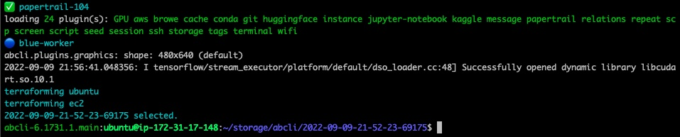

# blue-worker

`blue-worker` is an [ec2](https://aws.amazon.com/ec2/) cloud worker and an [`awesome-bash-cli`](https://github.com/kamangir/awesome-bash-cli) (`abcli`) [plugin](https://github.com/kamangir/blue-plugin).

To start a `blue-worker`, first create an [`abcli`](https://github.com/kamangir/awesome-bash-cli) instance,

```bash
abcli instance from_image
```

Then type in,

```bash
abcli git clone blue-worker install
abcli cookie cp worker
abcli init
abcli session start
```

